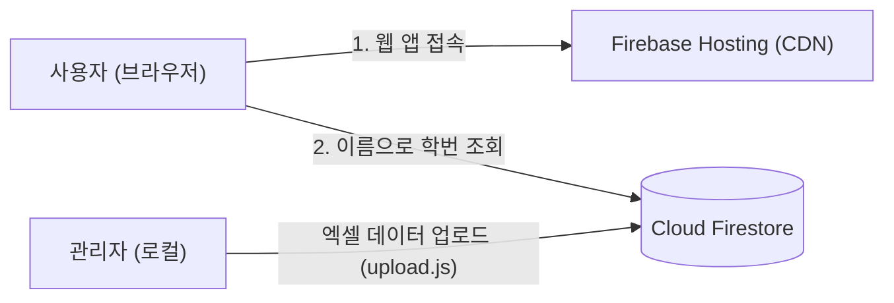

# 🎓 신입생 학번 조회 시스템 (Student Code Find)

영남이공대학교 소프트웨어융합과 신입생을 위한 학번 조회 웹 서비스입니다.  
별도의 백엔드 서버 없이 **Google Firebase** 기반의 완전한 서버리스(Serverless/BaaS) 구조로 구축되었습니다.

---

## 🌐 서비스 및 관리자 링크

- **배포 웹사이트**: [https://studentcodefind.web.app](https://studentcodefind.web.app) (보조 도메인: [studentcodefind.firebaseapp.com](https://studentcodefind.firebaseapp.com))
- **Firebase 콘솔 (대시보드)**: [Firebase Console 바로가기](https://console.firebase.google.com/project/studentcodefind/overview)
- **Firestore DB 관리**: [Firestore 데이터베이스](https://console.firebase.google.com/project/studentcodefind/firestore)

---

## 🛠 기술 스택

- **Frontend**: React 18, Vite, Vanilla CSS
- **Backend / Infra**: Google Firebase
  - **Firebase Hosting**: 전 세계 CDN을 통한 정적 웹 호스팅 및 SPA 라우팅
  - **Cloud Firestore**: 학생 데이터를 실시간 쿼리하는 NoSQL 데이터베이스
- **Data Pipeline**: Node.js, `xlsx` (Excel 데이터 일괄 파싱 및 Firestore 업로드)

---

## 🏛 시스템 아키텍처



1. **완전한 서버리스 (BaaS)**
   - 별도의 백엔드 인스턴스(Node.js/Spring 등) 없이 클라이언트와 Firebase 서비스 간 직접 연동
2. **보안 규칙 (Firestore Rules)**
   - `students` 컬렉션: 누구나 조회 가능(`allow read: if true;`), 외부 쓰기는 원천 차단(`allow write: if false;`)하여 데이터 위·변조 방지

---

## 📂 프로젝트 구조

```
student_code_find/
├── public/                 # 정적 리소스
├── scripts/
│   ├── upload.js           # 엑셀 파일 → Firestore 일괄 업로드 스크립트
│   └── check.js            # 업로드 데이터 검증 스크립트
├── src/
│   ├── firebase/
│   │   └── config.js       # Firebase SDK 초기화 및 Firestore 인스턴스
│   ├── App.jsx             # 학번 조회 메인 UI 및 검색 로직
│   ├── App.css             # 스타일 및 반응형 디자인
│   └── main.jsx
├── firebase.json           # Firebase Hosting 및 Firestore 규칙 배포 설정
├── firestore.rules         # Firestore 보안 규칙
└── 신입생 학번 및 정보 파일.xlsx # 원본 학생 데이터 엑셀
```

---

## 💻 실행 및 배포 가이드

### 1. 패키지 설치
```bash
npm install
```

### 2. 로컬 개발 서버 실행
```bash
npm run dev
```

### 3. 학생 데이터 업로드 (필요 시)
```bash
node scripts/upload.js
```

### 4. 프로덕션 빌드 및 Firebase 배포
```bash
# 빌드
npm run build

# Firebase 배포 (Hosting 및 Rules)
firebase deploy
```
